# Customer Journeys — TesisFar

Mapa completo de interacciones de cada rol con el sistema, desde el **descubrimiento** hasta la **fidelización / advocacy**.

> **Nota de formato:** el diagrama `journey` de Mermaid se dibuja **horizontalmente**, así que cuando hay muchas etapas se vuelve ilegible al exportar. Por eso cada rol se divide en **dos diagramas** (Fase 1: llegada al sistema · Fase 2: uso y cierre) y se incluye además una vista vertical con `flowchart TB` para exportación cómoda.

Etapas del customer journey clásico adaptadas al contexto académico de TesisFar:

| Etapa            | Qué significa aquí                                                      |
|------------------|-------------------------------------------------------------------------|
| **Descubrimiento** | El rol se entera de que TesisFar existe y para qué sirve.              |
| **Consideración**  | Entiende cómo le afecta y decide (o le toca) usarlo.                   |
| **Adquisición**    | Se registra, obtiene credenciales, entra por primera vez.             |
| **Onboarding**     | Primer contacto real con el dashboard y su rol.                       |
| **Uso**            | Flujo diario: crear, subir, comentar, evaluar, planificar.            |
| **Cierre**         | Momento de verdad — defensa, resultado, cierre de semestre.           |
| **Fidelización**   | Qué hace que vuelva o lo recomiende el próximo semestre.              |

Puntajes 1–5 = satisfacción emocional (1 = muy frustrante, 5 = excelente).

---

## Estudiante

### Fase 1 — Llegada al sistema

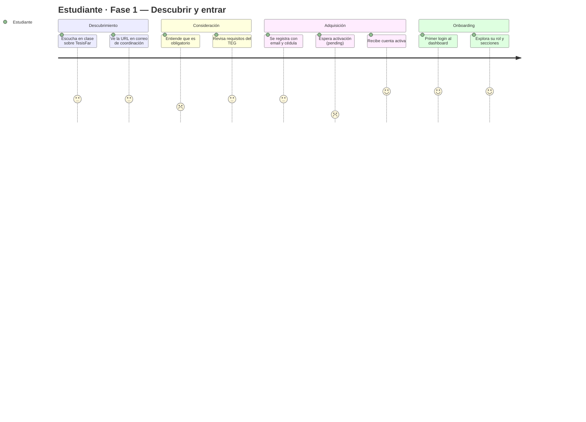

### Fase 2 — Uso, cierre y fidelización

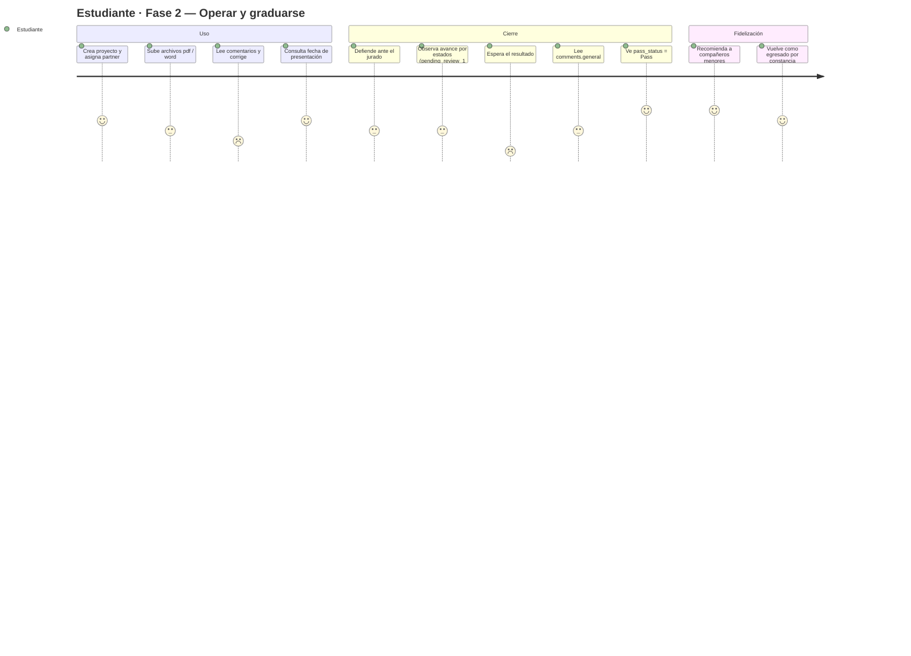

---

## Tutor

### Fase 1 — Llegada al sistema

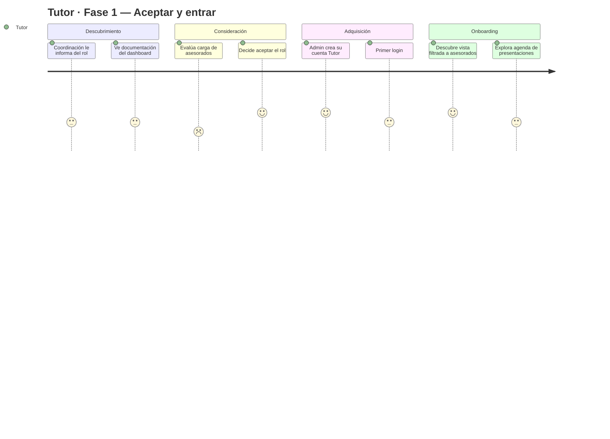

### Fase 2 — Uso, cierre y fidelización

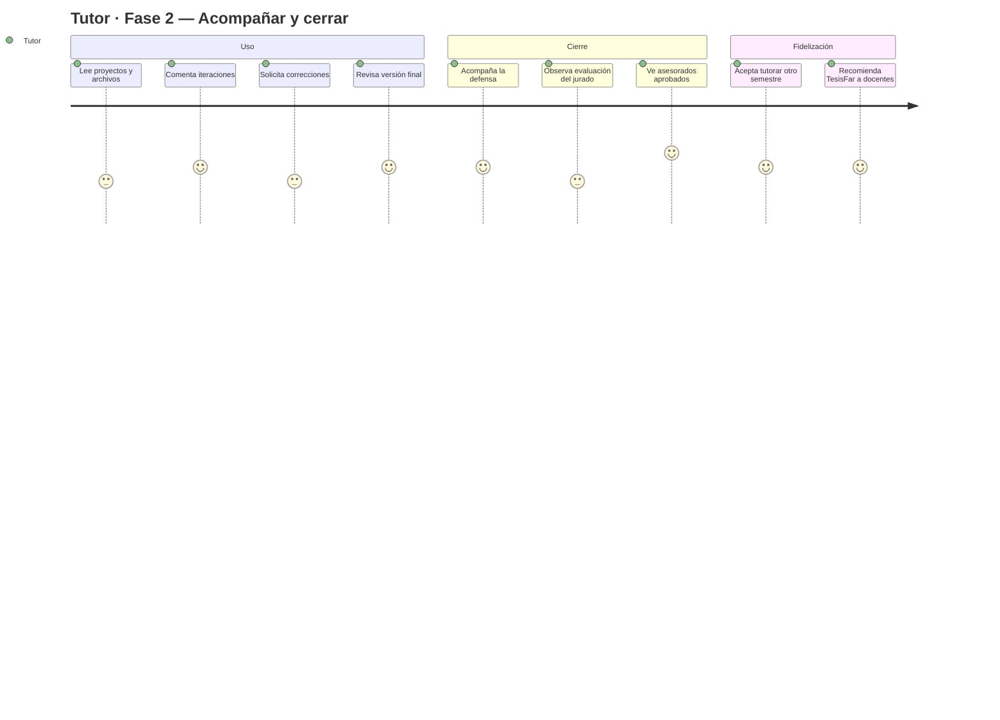

---

## Jurado

### Fase 1 — Llegada al sistema

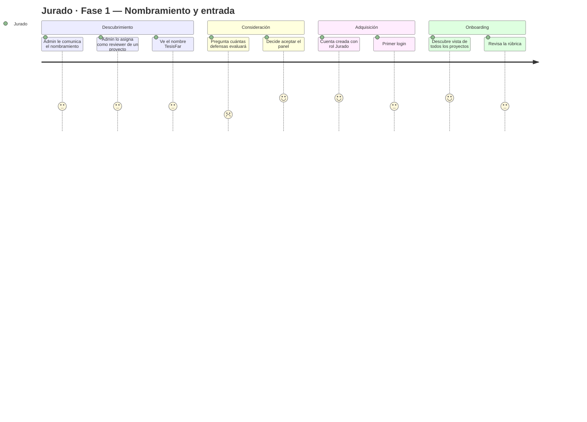

### Fase 2 — Uso, cierre y fidelización

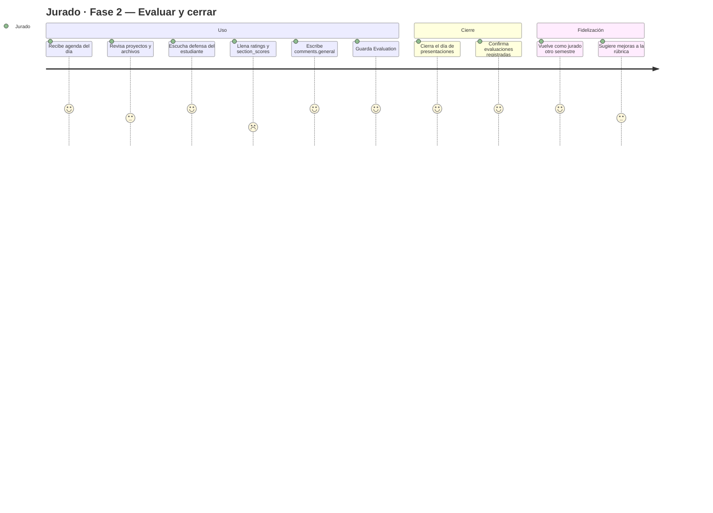

---

## Administrador

### Fase 1 — Adopción y configuración

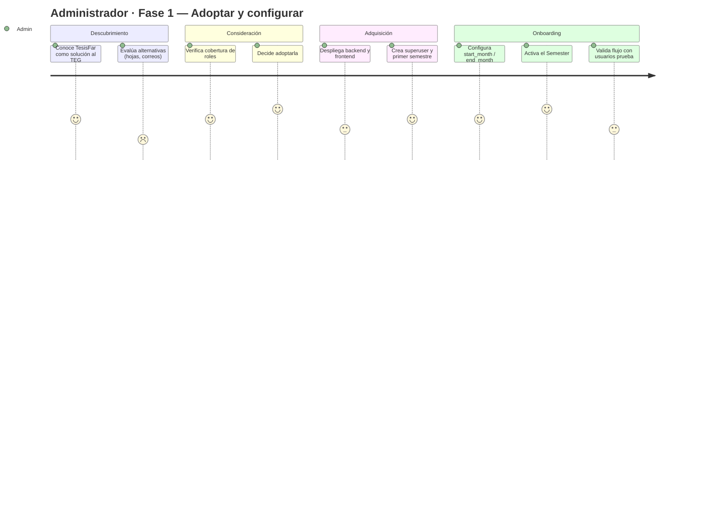

### Fase 2 — Operación del semestre

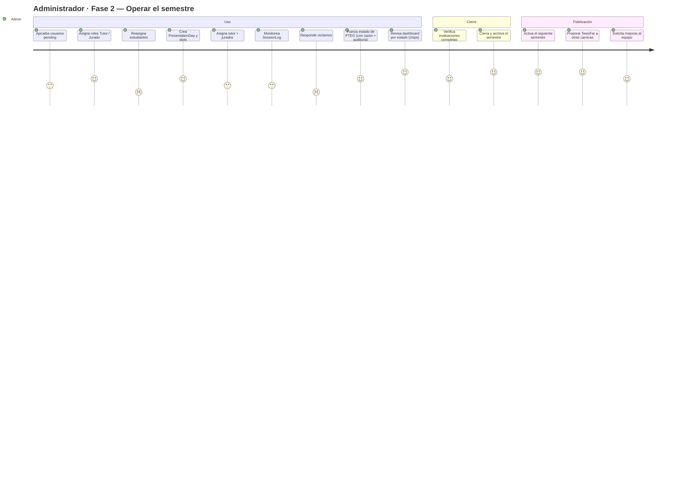

---

## Vista vertical unificada (para exportar cómodamente)

Si necesitas una sola imagen por rol que quepa en PDF/slide, usa este formato `flowchart TB` (top-bottom) que crece hacia abajo en vez de a lo ancho. Los iconos al inicio de cada nodo indican el score emocional:

- 😟 score 1 · 😕 score 2 · 😐 score 3 · 🙂 score 4 · 😄 score 5

### Estudiante — vista vertical

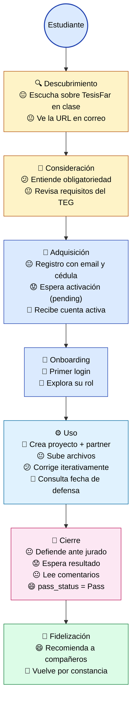

### Tutor — vista vertical

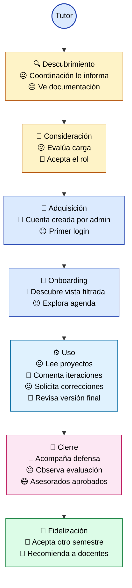

### Jurado — vista vertical

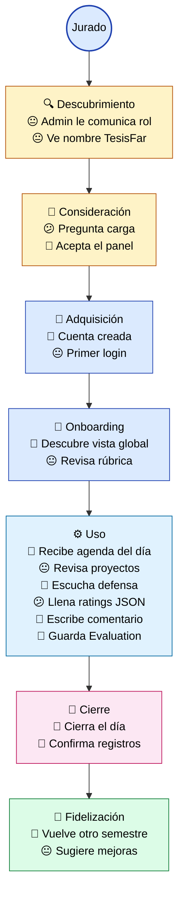

### Administrador — vista vertical

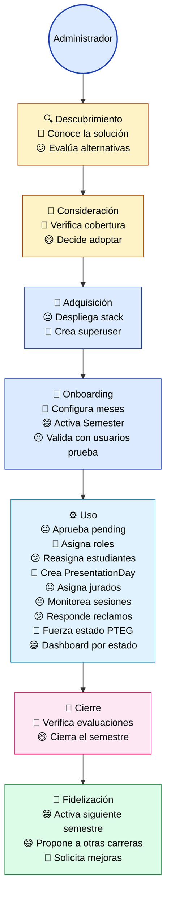

---

## Puntos de dolor críticos (score ≤ 2)

| Rol          | Momento                                          | Score | Oportunidad                                  |
|--------------|--------------------------------------------------|-------|----------------------------------------------|
| Estudiante   | Espera activación (`status=pending`)             | 1     | Auto-activación por dominio institucional    |
| Estudiante   | Leer comentarios y corregir                      | 2     | Ratings detallados visibles + historial      |
| Estudiante   | Esperar resultado post-defensa                   | 2     | ✅ Notificación in-app + email automática (task `20260425-003`) — campana en header, bandeja en Configuración → Notificaciones |
| Tutor        | Evaluar carga al aceptar                         | 2     | Vista previa de asesorados antes de aceptar  |
| Jurado       | Llenar ratings y section_scores                  | 2     | Plantilla por tipo de proyecto (no JSON)     |
| Admin        | Reasignar estudiantes entre tutores              | 2     | Drag-and-drop bulk en planificación          |
| Admin        | Responder reclamos de los 3 roles                | 2     | Bandeja de incidencias / tickets             |

---

## Leyenda

| Puntaje | Emoji | Significado                                  |
|---------|-------|----------------------------------------------|
| 1       | 😟    | Muy frustrante — dolor real, bloquea al rol  |
| 2       | 😕    | Incómodo — fricción o espera                 |
| 3       | 😐    | Neutro — funciona pero sin brillo            |
| 4       | 🙂    | Satisfactorio — el sistema ayuda             |
| 5       | 😄    | Excelente — momento de valor claro           |
