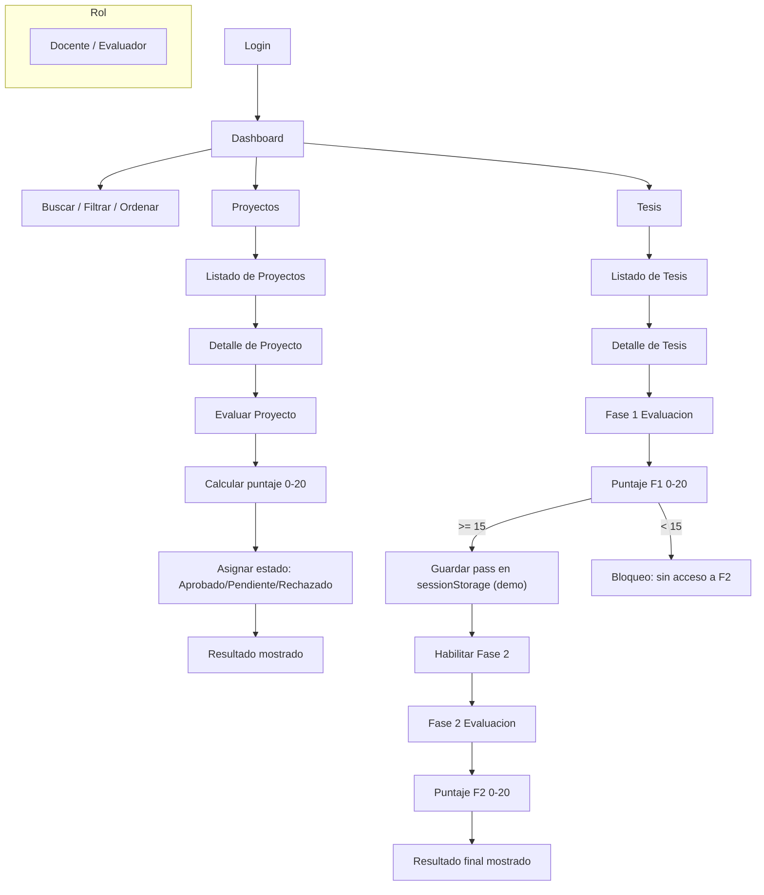
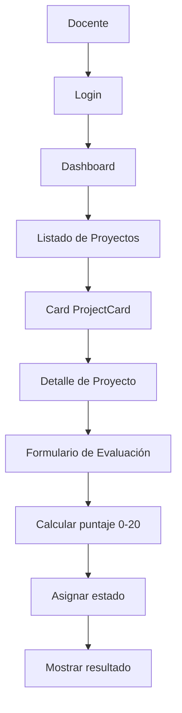
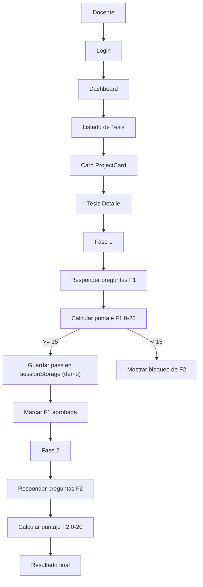

# Flujogramas del Proyecto (Mermaid)

> Referencia rápida en español, centrada en el rol **Docente/Evaluador** (otros roles se integrarán más adelante).

## Navegación principal (rol Docente/Evaluador)

## Flujo detallado: Proyectos (Docente)

## Flujo detallado: Tesis (Docente, con Fase 1 / Fase 2)

### Notas
- Puntaje: escala 0–20; umbral de aprobación ≥ 15.
- Datos mock: `src/lib/data/mockData.ts`.
- Lógica de puntaje: `src/lib/questions/scoring.ts`.
- Gateo de Fase 2 (tesis): depende de aprobar Fase 1 (demo actual: `sessionStorage`).
- Rutas de detalle: `/dashboard/proyectos/[id]`, `/dashboard/tesis/[id]`.
- El foco actual es el rol Docente/Evaluador; otros roles (admin, estudiante) se añadirán más adelante.
